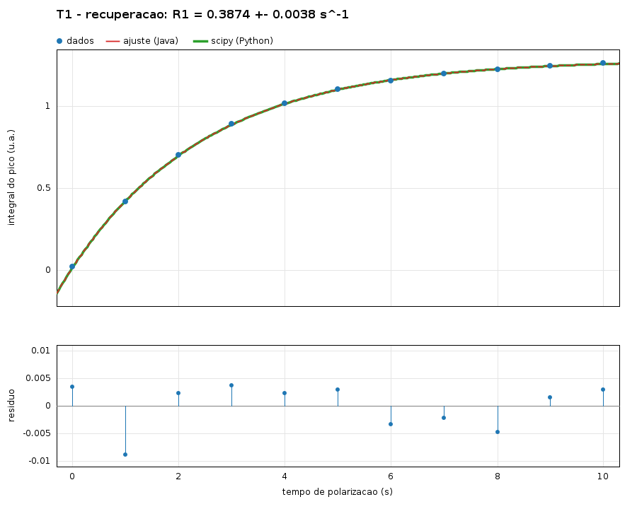
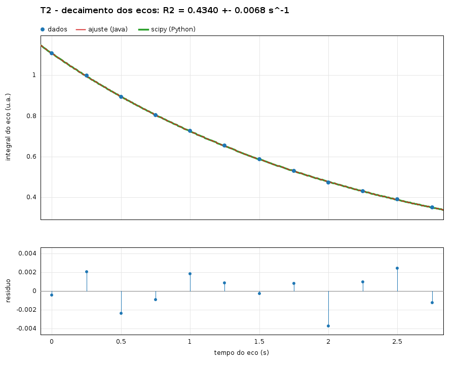
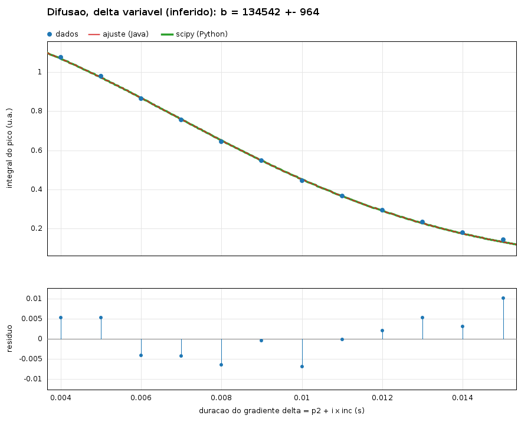
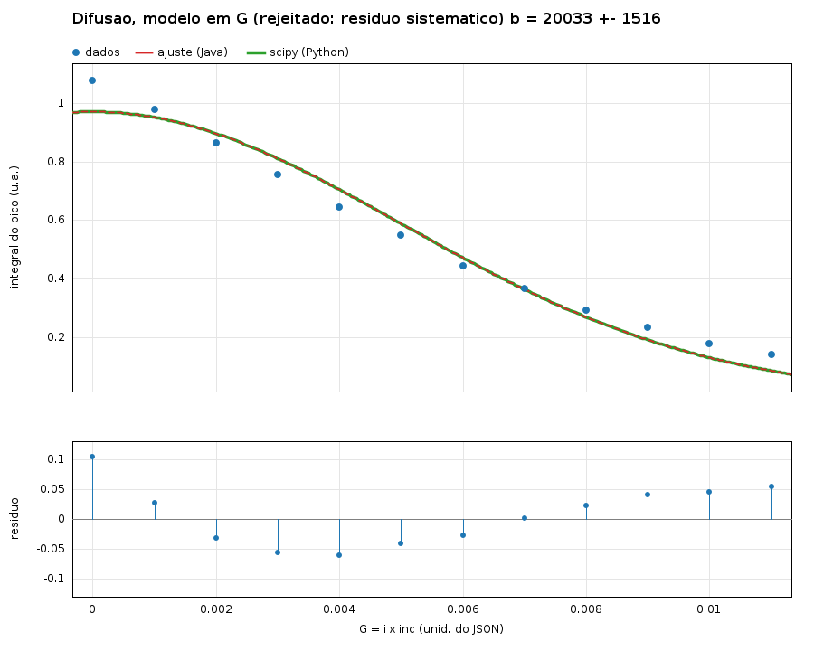

# Relatório de Validação — Módulo `analysis/` (Pessoa 3) — Python × Java

**Escopo:** ajuste de curvas (T1, T2, difusão), integração de pico e separação de ecos.
**Referência:** `scipy.optimize.curve_fit` sobre as integrais calculadas pelo pipeline Python
(`scripts/03_teste_t1_completo.py` e variantes para T2 e difusão), com os dados sintéticos do pacote
`Equipe03_Dados_NMR_Alunos`.

## 1. O que foi (e o que não foi) validado

Esta validação cobre **somente a etapa de ajuste** (Etapa 11/12 do roteiro): as mesmas integrais de
entrada são ajustadas em Python e em Java e os parâmetros são comparados. As integrais de entrada
vêm do Python (filtro Butterworth `filtfilt` 4ª ordem, janela, FFT `|fft|·2/n`, soma de bins em
2550–2850 Hz). As etapas **filtro → janela → FFT** em Java pertencem ao pacote `signal/` (Pessoa 2)
e **ainda não foram validadas**: o critério de aceitação delas é reproduzir as integrais abaixo
(arquivos `src/test/resources/*_integrais_python.csv`).

## 2. Metodologia

1. Python gera as integrais por scan/eco e ajusta com `curve_fit` (valores iniciais idênticos aos do Java).
2. Java (`RelaxationFit`, `DiffusionFit`, Levenberg–Marquardt próprio) ajusta as mesmas integrais.
3. Comparam-se parâmetros e incertezas (√diag da covariância, `absolute_sigma=False` nos dois).
4. Erro absoluto = |Python − Java|; erro relativo = erro absoluto / |Python|.
5. Tolerâncias definidas antes da comparação: 1e-5 (relaxação) e 1e-4 (difusão, ver 4.2).

Reprodução: `java -cp target/classes br.edu.nmr.analysis.ValidationReport src/test/resources`
(gera as tabelas abaixo) e `java -cp target/classes br.edu.nmr.ui.GenerateFitPlots src/test/resources docs/validacao`
(gera os gráficos).

## 3. Resultados

### T1 (recuperacao, y = A exp(-R t) + C)

| Grandeza | Python | Java | Erro absoluto | Erro relativo | Tolerancia (rel.) | Resultado |
|---|---|---|---|---|---|---|
| A | -1.264203820 | -1.264203819 | 2.70e-10 | 2.13e-10 | 1e-05 | OK |
| R1 (s^-1) | 0.3874346214 | 0.3874346235 | 2.14e-09 | 5.52e-09 | 1e-05 | OK |
| C | 1.284973520 | 1.284973519 | 1.55e-09 | 1.20e-09 | 1e-05 | OK |
| sigma(R1) | 0.003755348889 | 0.003755345122 | 3.77e-09 | 1.00e-06 | 1e-05 | OK |
| T1 = 1/R1 (s) | 2.581080639 | 2.581080625 | 1.42e-08 | 5.52e-09 | 1e-05 | OK |

Java: R^2 = 0.999892, RSS = 1.7209e-04, max|residuo| = 8.808e-03, iteracoes = 4, convergiu = true.

### T2 (decaimento dos ecos, y = A exp(-R t) + C)

| Grandeza | Python | Java | Erro absoluto | Erro relativo | Tolerancia (rel.) | Resultado |
|---|---|---|---|---|---|---|
| A | 1.086276112 | 1.086276116 | 4.23e-09 | 3.89e-09 | 1e-05 | OK |
| R2 (s^-1) | 0.4340299031 | 0.4340298999 | 3.17e-09 | 7.31e-09 | 1e-05 | OK |
| C | 0.02098213995 | 0.02098213529 | 4.66e-09 | 2.22e-07 | 1e-05 | OK |
| sigma(R2) | 0.006831333622 | 0.006831327771 | 5.85e-09 | 8.57e-07 | 1e-05 | OK |
| T2 = 1/R2 (s) | 2.303988718 | 2.303988735 | 1.69e-08 | 7.31e-09 | 1e-05 | OK |

Java: R^2 = 0.999944, RSS = 3.7943e-05, max|residuo| = 3.711e-03, iteracoes = 6, convergiu = true.

### Difusao, modelo em G (I = I0 exp(-b G^2), G = i x inc) - contra curve_fit padrao

| Grandeza | Python | Java | Erro absoluto | Erro relativo | Tolerancia (rel.) | Resultado |
|---|---|---|---|---|---|---|
| I0 | 0.9715861915 | 0.9715866321 | 4.41e-07 | 4.54e-07 | 1e-04 | OK |
| b | 20033.40741 | 20033.44838 | 4.10e-02 | 2.05e-06 | 1e-04 | OK |
| sigma(b) | 1516.032013 | 1516.052987 | 2.10e-02 | 1.38e-05 | 1e-04 | OK |

Java: R^2 = 0.974200, RSS = 2.9145e-02, max|residuo| = 1.044e-01, iteracoes = 10, convergiu = true.

### Difusao, modelo em G - contra scipy com ftol=xtol=gtol=1e-15

| Grandeza | Python | Java | Erro absoluto | Erro relativo | Tolerancia (rel.) | Resultado |
|---|---|---|---|---|---|---|
| I0 | 0.9715866318 | 0.9715866321 | 2.62e-10 | 2.69e-10 | 1e-06 | OK |
| b | 20033.44835 | 20033.44838 | 3.22e-05 | 1.61e-09 | 1e-06 | OK |
| sigma(b) | 1516.053018 | 1516.052987 | 3.10e-05 | 2.05e-08 | 1e-06 | OK |

### Difusao, delta variavel (I = I0 exp(-b delta^2 (Delta - delta/3)), delta = p2 + i x inc) - curve_fit padrao

| Grandeza | Python | Java | Erro absoluto | Erro relativo | Tolerancia (rel.) | Resultado |
|---|---|---|---|---|---|---|
| I0 | 1.268196912 | 1.268196910 | 2.85e-09 | 2.25e-09 | 1e-04 | OK |
| b | 134542.4290 | 134542.4284 | 6.30e-04 | 4.68e-09 | 1e-04 | OK |
| sigma(b) | 964.1333914 | 964.1331236 | 2.68e-04 | 2.78e-07 | 1e-04 | OK |

Java: R^2 = 0.999708, RSS = 3.3039e-04, max|residuo| = 1.017e-02, iteracoes = 5, convergiu = true.

Todos os valores de relaxação concordam com o scipy em ~1e-9 (erro relativo) nos parâmetros.
O T1 recuperado, R1 = 0,3874 s⁻¹, coincide com o valor de 0,39 s⁻¹ do artigo e do `LEIA-ME.txt`.

### Gráficos (dados, curva Java, curva scipy sobreposta, resíduos)

## 4. Interpretação das diferenças

### 4.1 Relaxação (T1, T2)
As diferenças (~1e-9) são ruído de ponto flutuante e de critério de parada dos dois otimizadores.
O sigma(R) tem erro relativo de ~1e-6, um pouco maior por depender da matriz jacobiana
(analítica no Java, diferença finita no scipy).

### 4.2 Difusão: Java × `curve_fit` padrão
O erro relativo em `b` é 2e-6 contra o `curve_fit` padrão, mas **1,6e-9 contra o scipy com
tolerâncias 1e-15**. Ou seja, o Java está convergido ao mínimo; o `curve_fit` com parâmetros
padrão para ~2e-6 antes dele. Por isso a tolerância da difusão é 1e-4 e foi acrescentada a
comparação com a referência apertada.

## 5. Pontos em aberto e inferências (leia antes de usar os números de difusão e T2)

1. **Separação dos ecos (T2) é uma inferência.** O JSON traz `soff = slen = inc = 0,25 s` e 12 ecos;
   com eco k = `[soff + k·inc, +slen)`, a última janela termina exatamente em 3,25 s = `nsamp/sr` e cada
   janela contém um eco (centros em 0,345; 0,595; … s). Isso não foi confrontado com `split` do pynmred
   (repositório não disponível durante o desenvolvimento). Eixo de tempo adotado: `t_k = k·inc`
   (um deslocamento constante não altera R2). **Resultado: R2 = 0,4340 s⁻¹, T2 = 2,304 s.**
2. **Difusão: o que varia entre os scans não está definido no JSON.**
   - Modelo `I0·exp(−b·G²)` com G = i·inc **não descreve os dados**: R² = 0,974, resíduos
     sistemáticos de até 0,10 (gráfico `Difusao_G2_ajuste.png`).
   - Modelo com **duração do gradiente variável**, δᵢ = p2 + i·inc e Δ = tau = 0,08 s fixo,
     `I = I0·exp[−b·δ²(Δ−δ/3)]`, ajusta no nível do ruído (R² = 0,9997, resíduo máx. 0,010; RSS
     ~90× menor). **É uma hipótese que os dados favorecem, não um fato confirmado.** Confirmar no
     notebook de difusão do pynmred qual grandeza é varrida.
   - **D em m²/s não pode ser calculado**: `b = D·γ²·G²` exige o valor de G (calibração da bobina de
     gradiente), que não consta nos arquivos. O código devolve `D = NaN` quando G não é informado,
     em vez de inventar um valor. Se G for fornecido (T/m), `DiffusionFit.fitDuration` devolve D.
3. **A integral usa a regra original (soma de bins)**, para equivalência com o Python. A integral com
   unidade (soma × Δf) está disponível separadamente (`PeakIntegrator.integralWithUnit`).
4. Os dados são **sintéticos** (ver `LEIA-ME.txt`), não os experimentais originais dos autores.

## 6. Testes automatizados relacionados

`FitTest`, `ReferenceFitTest` (T1, T2, difusão em G e em δ, separação de ecos, recuperação de
parâmetros em dados sintéticos, entradas inválidas) e `FitPlotTest`: 16 casos.
